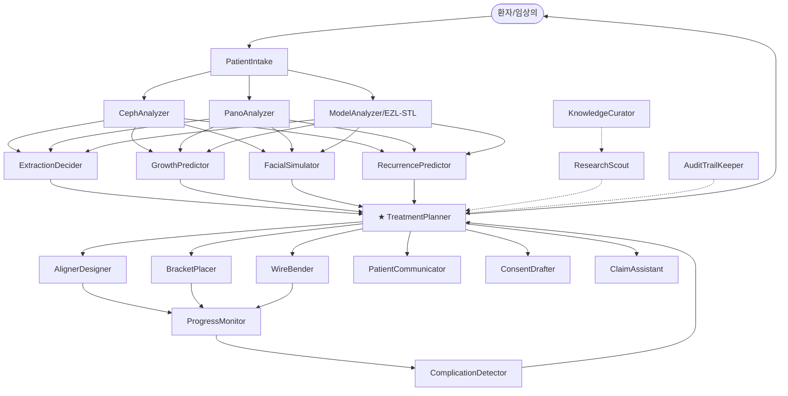

# VCOS 기반 AI 에이전트 20개 구조

> 20-19 Orthodontics AI 플랫폼의 멀티 에이전트 아키텍처. 각 에이전트는 독립된 책임을 가지며, 마스터 오케스트레이터(`TreatmentPlanner`)가 워크플로우를 조율한다.

---

## 0. 오케스트레이션 다이어그램

★ TreatmentPlanner = 마스터 오케스트레이터

---

## 1. 진단 에이전트 (Diagnosis · 4종)

### A1. PatientIntake
| 속성 | 값 |
|---|---|
| 역할 | 환자 정보 수집·검증·정규화 |
| 입력 | 폼(name, dob, gender), 의료력 PDF |
| 출력 | `Patient {id, age, ageGroup, gender, history}` |
| 모델 | Gemini 1.5 Flash (구조화 추출) |
| 트리거 | 사용자 폼 제출 |
| 의존성 | — |

### A2. CephAnalyzer
| 속성 | 값 |
|---|---|
| 역할 | 측면 두부방사선(Lateral Cephalogram) 자동 분석 |
| 입력 | Ceph X-ray 이미지 |
| 출력 | `{SNA, SNB, ANB, FMA, IMPA, U1-SN, FH-NA, ...}` |
| 모델 | Gemini Vision + 자체 랜드마크 검출 모델 |
| 트리거 | Ceph 업로드 |
| 의존성 | A1 |

### A3. PanoAnalyzer
| 속성 | 값 |
|---|---|
| 역할 | 파노라마 X-ray에서 치아 상태·매복·치근 분석 |
| 입력 | Panoramic X-ray |
| 출력 | `{toothMap[FDI→status], impactedTeeth[], rootIssues[]}` |
| 모델 | Gemini Vision + segmentation |
| 트리거 | Pano 업로드 |
| 의존성 | A1 |

### A4. ModelAnalyzer (EZL-STL)
| 속성 | 값 |
|---|---|
| 역할 | STL 3D 모형의 치열궁·Bolton·Spee 측정 |
| 입력 | STL 파일 (50MB) |
| 출력 | `{arch, tooth, discrepancy, bolton, spee, crowding, confidence}` |
| 모델 | EZL-STL Engine (Vanilla JS, 룰베이스) |
| 트리거 | STL 업로드 |
| 의존성 | — |

---

## 2. 예측 에이전트 (Prediction · 4종)

### A5. ExtractionDecider
| 속성 | 값 |
|---|---|
| 역할 | 발치/비발치 판단 + 권장 치아 |
| 입력 | A2·A4 출력 통합 + 환자 연령군 |
| 출력 | `{score, recommendation, teeth[], reasoning[], risks[], alternatives[]}` |
| 모델 | Tweed/Steiner 룰 + Gemini 1.5 Flash (JSON 구조화) |
| 트리거 | 사용자 요청 (extraction-ai.html) |
| 의존성 | A1, A2, A4 |

### A6. GrowthPredictor
| 속성 | 값 |
|---|---|
| 역할 | 어린이 잔여 성장량·peak velocity·치료 시기 예측 |
| 입력 | CVMS, 부모 키, 골연령, 신장/체중 |
| 출력 | `{remainingGrowthCm, skeletalStage, recommendation, peakAge}` |
| 모델 | Mid-parental + CVMS 가중 + Gemini 분석 |
| 트리거 | 어린이 환자 + 사용자 요청 |
| 의존성 | A1 (ageGroup=child) |

### A7. FacialSimulator
| 속성 | 값 |
|---|---|
| 역할 | 측면 안모 변화 + E-line 분석 |
| 입력 | 슬라이더 5종(상악, 하악, 입술×2, 턱) + 사진(선택) |
| 출력 | `{score, profileShift, lipPosition, chinPosition, eLineUpper, eLineLower}` |
| 모델 | SVG 보간 + Gemini Vision |
| 트리거 | 슬라이더 조작, AI 분석 버튼 |
| 의존성 | A2 |

### A8. RecurrencePredictor
| 속성 | 값 |
|---|---|
| 역할 | 1·3·5·10년 재발 확률 + 보정 프로토콜 |
| 입력 | 치료 종료 IMPA, 보정장치, 협조도 등 |
| 출력 | `{score, probabilities{y1,y3,y5,y10}, recommendation, risks[]}` |
| 모델 | 가중 합산 + Gemini |
| 트리거 | 사용자 요청 |
| 의존성 | A4 (선택), 치료 종료 데이터 |

---

## 3. 마스터 오케스트레이터 (1종)

### A9. TreatmentPlanner ★
| 속성 | 값 |
|---|---|
| 역할 | 4종 진단·예측 결과를 종합해 **단일 치료계획** 산출 |
| 입력 | A5·A6·A7·A8 출력 + 환자 선호도(가격, 기간, 심미) |
| 출력 | `{plan: [phases], appliances[], duration, risks[], cost}` |
| 모델 | Gemini 1.5 Pro (long-context, 2M tokens) |
| 트리거 | 4개 예측 에이전트 모두 완료 시 |
| 의존성 | A5, A6, A7, A8 |
| 비고 | TreatmentPlanner의 출력은 사람-검수 후에만 환자에게 노출 |

---

## 4. 실행 에이전트 (Execution · 3종)

### A10. AlignerDesigner
| 속성 | 값 |
|---|---|
| 역할 | 클리어얼라이너(Invisalign 등) 단계별 설계 |
| 입력 | TreatmentPlanner의 plan + STL |
| 출력 | `{stages[], stagingFile, attachmentsMap}` |
| 모델 | 자체 모션 플래너 (향후 fine-tune) |
| 의존성 | A9 |

### A11. BracketPlacer
| 속성 | 값 |
|---|---|
| 역할 | 고정식 교정 브라켓 위치 최적화 |
| 입력 | STL + 치아 segmentation |
| 출력 | `{bracketPositions[fdi→{x,y,z,rotation}]}` |
| 모델 | 룰베이스 (FA point, Andrews 법칙) + 자체 모델 |
| 의존성 | A9, A4 |

### A12. WireBender
| 속성 | 값 |
|---|---|
| 역할 | 와이어 형상 시뮬레이션 (CAD 출력) |
| 입력 | BracketPlacer 출력 |
| 출력 | `{wireGeometry, bendPoints[], material}` |
| 모델 | 기하학적 알고리즘 |
| 의존성 | A11 |

---

## 5. 모니터링 에이전트 (Monitoring · 2종)

### A13. ProgressMonitor
| 속성 | 값 |
|---|---|
| 역할 | 정기 내원 시 치료 진척도 평가 |
| 입력 | 매 방문 STL/사진 + 시간순 시계열 |
| 출력 | `{progressPercent, deviations[], expectedRemainingMonths}` |
| 모델 | Diff-based + Gemini Vision |
| 트리거 | 진료 일정 (cron) |
| 의존성 | A4 (시계열) |

### A14. ComplicationDetector
| 속성 | 값 |
|---|---|
| 역할 | 합병증(치근 흡수, TMD, 잇몸 퇴축) 조기 감지 |
| 입력 | 진료 사진·X-ray·환자 보고 증상 |
| 출력 | `{alerts[severity, description, action]}` |
| 모델 | Gemini Vision + 룰 |
| 트리거 | A13 결과 + 환자 자기보고 |
| 의존성 | A13 |

---

## 6. 운영 에이전트 (Operations · 6종)

### A15. PatientCommunicator
| 속성 | 값 |
|---|---|
| 역할 | 환자 안내 메시지(SMS/이메일) 자동 생성 |
| 입력 | 진단 결과, 다음 약속 |
| 출력 | `{message, channel, scheduledAt}` |
| 모델 | Gemini Flash (한국어 자연어 생성) |
| 트리거 | 진단 완료, 일정 변경 |

### A16. ConsentDrafter
| 속성 | 값 |
|---|---|
| 역할 | 치료 동의서 자동 초안 생성 |
| 입력 | TreatmentPlan |
| 출력 | PDF 초안 (서명란 포함) |
| 모델 | Gemini + 템플릿 |
| 트리거 | 치료 시작 직전 |

### A17. ClaimAssistant
| 속성 | 값 |
|---|---|
| 역할 | 보험 청구 보조 (코드 매핑) |
| 입력 | 진단 코드, 시술 코드 |
| 출력 | 청구서 템플릿 |
| 모델 | 룰베이스 매핑 |

### A18. ResearchScout
| 속성 | 값 |
|---|---|
| 역할 | PubMed/Cochrane 최신 논문 자동 요약 |
| 입력 | 검색 키워드 (예: "Class III premolar extraction") |
| 출력 | 상위 5개 논문 요약 + DOI |
| 모델 | Gemini + Perplexity API |
| 트리거 | 주 1회 cron, 또는 사용자 요청 |

### A19. KnowledgeCurator
| 속성 | 값 |
|---|---|
| 역할 | RAG 지식베이스 큐레이션·임베딩 갱신 |
| 입력 | A18 결과, 내부 사례 |
| 출력 | pgvector `knowledge_chunks` 갱신 |
| 모델 | text-embedding-004 |
| 트리거 | 주 1회 (Vercel Cron) |

### A20. AuditTrailKeeper
| 속성 | 값 |
|---|---|
| 역할 | 모든 에이전트 호출·결과·사용자 검수 로그 보존 |
| 입력 | 에이전트 입출력 |
| 출력 | `audit_logs` 테이블 (Postgres) |
| 모델 | — (deterministic) |
| 트리거 | 모든 에이전트 호출 |
| 비고 | HIPAA·GDPR 감사 추적용. 7년 보존. |

---

## 7. 협업 패턴

### 7-1. 진단 단계 (병렬 → 수렴)
1. A1(PatientIntake) → 환자 컨텍스트 확립
2. A2·A3·A4 **병렬 실행** (Ceph/Pano/STL)
3. A5·A6·A7·A8 **병렬 실행** (4종 예측)
4. A9(TreatmentPlanner)에서 **수렴**

### 7-2. 실행 단계 (순차)
A10/A11/A12를 plan 타입에 따라 **하나만 선택** 또는 순차 실행.

### 7-3. 모니터링 루프
A13 → A14 → (이상 탐지 시) → A9 재호출 (계획 수정)

### 7-4. 운영 백그라운드
A15·A16·A17은 진료 워크플로우 외부에서 트리거.
A18·A19·A20은 시스템 백그라운드 (cron).

---

## 8. 비용 가드레일

| 에이전트 | 모델 | 호출당 비용 (USD) | 일일 한도 |
|---|---|---|---|
| A2·A3 (Vision) | Gemini Vision | ~$0.01 | 500 |
| A5·A6·A7·A8 (JSON) | Gemini Flash | ~$0.001 | 5,000 |
| A9 (Planner) | Gemini 1.5 Pro | ~$0.05 | 200 |
| A18 (Scout) | Perplexity API | ~$0.005 | 100 |
| A19 (Embed) | text-embedding-004 | ~$0.0001 | 50,000 chunk |

월 운영비 추정: 클리닉 1곳 환자 200명 기준 **$120-180**.

---

## 9. SaaS 확장 시 추가 에이전트 (V2)

- **A21. AppointmentScheduler** — 일정 자동 조율
- **A22. BillingAgent** — 구독 청구·결제 실패 처리
- **A23. ChurnPredictor** — 환자 이탈 예측
- **A24. MarketingCopywriter** — 환자별 후기 요청·SNS 컨텐츠
- **A25. ClinicianCoach** — 임상의를 위한 케이스 학습 추천
